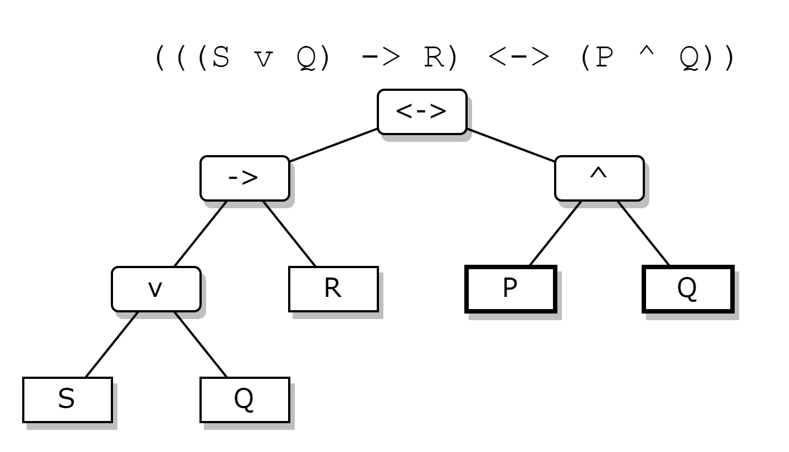

# Notes

## Error Checking
This will consist of:
- Checking for invalid characters such as @, etc.
- Checking for unequal number of opening and closing brackets.

## Parsing String into Array
This will parse the statement as a string by first analyzing the statement and
extracting elements like the number of variables as well as the variables, and 
also returning an array of all 'pieces' of the statement. From there, it calls
a parsing function that turns the 'simple' array into a tree like structure, 
having a central connector used for the propositional calculations, a left part
and a right part. 

### String to Simple Array

### Processing Connectives in Array

### Restructuring Array into Tree Structured Array

## Validating Array
This will take pieces of the parsed statement and validate it before it continues 
parsing. For example, if an and connective has a left side and a right side.
Also, if we have an opening bracket
### Processing Connectives

### Processing Brackets

